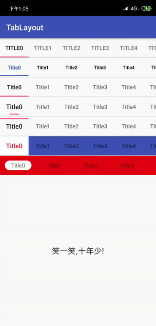

# TabLayout

在原design包中的TabLayout的基础上增加了一些属性。

为了防止和系统的TabLayout冲突，所以属性需要增加ex开头。


***V1.1.0和之前版本不兼容，主要区别是在设置文字效果，之前是单独设置textsize，textcolor效果，因为有时候滑动选中的可能还需要修改textStyle等等，所以这次就把这些合到了TabTextAppearance和TabSelectTextAppearance中。***

V110属性变化如下：

```
<declare-styleable name="ExTabLayout">
        <!--设置指示器的Drawable-->
        <attr name="exTabIndicatorDrawable" format="reference" />
        <!--设置指示器位置-->
        <attr name="exTabIndicatorGravity" format="enum">
            <enum name="top" value="0" />
            <enum name="center" value="1" />
            <enum name="bottom" value="2" />
        </attr>
        <!--设置指示器拉伸效果 0<=Stretch<=1 0为没有效果-->
        <attr name="exTabIndicatorStretch" format="float" />
        <!--设置指示器颜色,和原效果相同,如果设置了exTabIndicatorDrawable,那么该效果无效 -->
        <attr name="exTabIndicatorColor" format="color" />
        <!--设置宽度,可以设置等宽,也可以设置具体宽度-->
        <attr name="exTabIndicatorWidth" format="dimension|enum">
            <enum name="equalToTab" value="-1" />
            <enum name="equalToText" value="-2" />
            <enum name="equalToIcon" value="-3" />
            <enum name="equalToCustom" value="-4" />
        </attr>
        <!--设置高度,同上-->
        <attr name="exTabIndicatorHeight" format="dimension|enum">
            <enum name="equalToTab" value="-1" />
            <enum name="equalToText" value="-2" />
            <enum name="equalToIcon" value="-3" />
            <enum name="equalToCustom" value="-4" />
        </attr>
        <!--设置指示器间距,和exTabIndicatorGravity一起使用,如果设置top,那么就是和上方的间距,如果设置bottom,那么就是和下方的间距 -->
        <attr name="exTabIndicatorPadding" format="dimension" />
        <attr name="exTabContentStart" format="dimension" />
        <!--该属性原为设置tab的背景颜色,但是我改写了部分代码,所以不要设置成不透明的-->
        <!--如果设置会覆盖掉指示器效果,这个只设置聚焦效果,如水波纹-->
        <attr name="exTabBackground" format="reference" />
        <attr name="exTabMode">
            <enum name="scrollable" value="0" />
            <enum name="fixed" value="1" />
        </attr>
        <attr name="exTabGravity">
            <enum name="fill" value="0" />
            <enum name="center" value="1" />
        </attr>
        <attr name="exTabMinWidth" format="dimension" />
        <attr name="exTabMaxWidth" format="dimension" />
        <attr name="exTabPaddingStart" format="dimension" />
        <attr name="exTabPaddingTop" format="dimension" />
        <attr name="exTabPaddingEnd" format="dimension" />
        <attr name="exTabPaddingBottom" format="dimension" />
        <attr name="exTabPadding" format="dimension" />
        <attr name="exTabTextAppearance" format="reference" />
        <!--新增属性-->
        <attr name="exTabSelectedTextAppearance" format="reference" />
        <!--去除了下方所有属性-->
        <attr name="exTabTextSize" format="dimension" />
        <!--选中字体大小-->
        <attr name="exTabSelectedTextSize" format="dimension" />
        <attr name="exTabTextColor" format="color" />
        <attr name="exTabSelectedTextColor" format="color" />
    </declare-styleable>
```

V1.0.5

属性如下：

```
<declare-styleable name="ExTabLayout">
        <!--设置指示器的Drawable-->
        <attr name="exTabIndicatorDrawable" format="reference" />
        <!--设置指示器位置-->
        <attr name="exTabIndicatorGravity" format="enum">
            <enum name="top" value="0" />
            <enum name="center" value="1" />
            <enum name="bottom" value="2" />
        </attr>
        <!--设置指示器拉伸效果 0<=Stretch<=1 0为没有效果-->
        <attr name="exTabIndicatorStretch" format="float" />
        <!--设置指示器颜色,和原效果相同,如果设置了exTabIndicatorDrawable,那么该效果无效 -->
        <attr name="exTabIndicatorColor" format="color" />
        <!--设置宽度,可以设置等宽,也可以设置具体宽度-->
        <attr name="exTabIndicatorWidth" format="dimension|enum">
            <enum name="equalToTab" value="-1" />
            <enum name="equalToText" value="-2" />
            <enum name="equalToIcon" value="-3" />
            <enum name="equalToCustom" value="-4" />
        </attr>
        <!--设置高度,同上-->
        <attr name="exTabIndicatorHeight" format="dimension|enum">
            <enum name="equalToTab" value="-1" />
            <enum name="equalToText" value="-2" />
            <enum name="equalToIcon" value="-3" />
            <enum name="equalToCustom" value="-4" />
        </attr>
        <!--设置指示器间距,和exTabIndicatorGravity一起使用,如果设置top,那么就是和上方的间距,如果设置bottom,那么就是和下方的间距 -->
        <attr name="exTabIndicatorPadding" format="dimension" />
        <attr name="exTabContentStart" format="dimension" />
        <!--该属性原为设置tab的背景颜色,但是我改写了部分代码,所以不要设置成不透明的-->
        <!--如果设置会覆盖掉指示器效果,这个只设置聚焦效果,如水波纹-->
        <attr name="exTabBackground" format="reference" />
        <attr name="exTabMode">
            <enum name="scrollable" value="0" />
            <enum name="fixed" value="1" />
        </attr>
        <attr name="exTabGravity">
            <enum name="fill" value="0" />
            <enum name="center" value="1" />
        </attr>
        <attr name="exTabMinWidth" format="dimension" />
        <attr name="exTabMaxWidth" format="dimension" />
        <attr name="exTabTextAppearance" format="reference" />
        <attr name="exTabTextSize" format="dimension" />
        <!--选中字体大小-->
        <attr name="exTabSelectedTextSize" format="dimension" />
        <attr name="exTabTextColor" format="color" />
        <attr name="exTabSelectedTextColor" format="color" />
        <attr name="exTabPaddingStart" format="dimension" />
        <attr name="exTabPaddingTop" format="dimension" />
        <attr name="exTabPaddingEnd" format="dimension" />
        <attr name="exTabPaddingBottom" format="dimension" />
        <attr name="exTabPadding" format="dimension" />
    </declare-styleable>

```

已经发布到jitpack上：

```
repositories {
    jcenter()
    maven { url "https://jitpack.io" }
    google()
}
```

```
implementation('com.github.AWarmHug:TabLayout:x.y.z') {
    exclude group: 'com.android.support'
}
```

效果如图：



历史版本V1.0.4：

1. 设置下方横线宽度：固定宽度（xxdp），和文字等宽，和图标等宽，和自定义等宽，
2. 设置下方横线离底部的距离，
3. 设置字体大小
4. 设置绘制形状：矩形和圆角矩形
5. 设置拉伸值，0<=stretch<1 (如果设置0就是没有拉伸和原效果相同)

具体可以查看res/values/attrs

```
<attr name="tabIndicatorEqual" format="enum">
    <enum name="equalToTab" value="-1" />
    <enum name="equalToText" value="-2" />
    <enum name="equalToIcon" value="-3" />
    <enum name="equalToCustom" value="-4" />
</attr>
<attr name="tabIndicatorWidth" format="dimension" />
<attr name="tabIndicatorBottom" format="dimension" />

<attr name="tabTextSize" format="dimension" />
<attr name="tabSelectedTextSize" format="dimension" />

<attr name="tabIndicatorShape" format="enum">
    <enum name="rect" value="0" />
    enum name="roundRect" value="1" />
</attr>
<attr name="tabIndicatorStretch" format="float" />
```

Width是和Equal冲突的，如果设置了具体的宽度，那么Equal就无效了，

tabTextSize/tabSelectedTextSize和selectedTextColor用法相同，

会覆盖掉tabTextAppearance已经设置好的效果，

Stretch为0-1(不包含1)，如果值越大拉伸效果越明显，